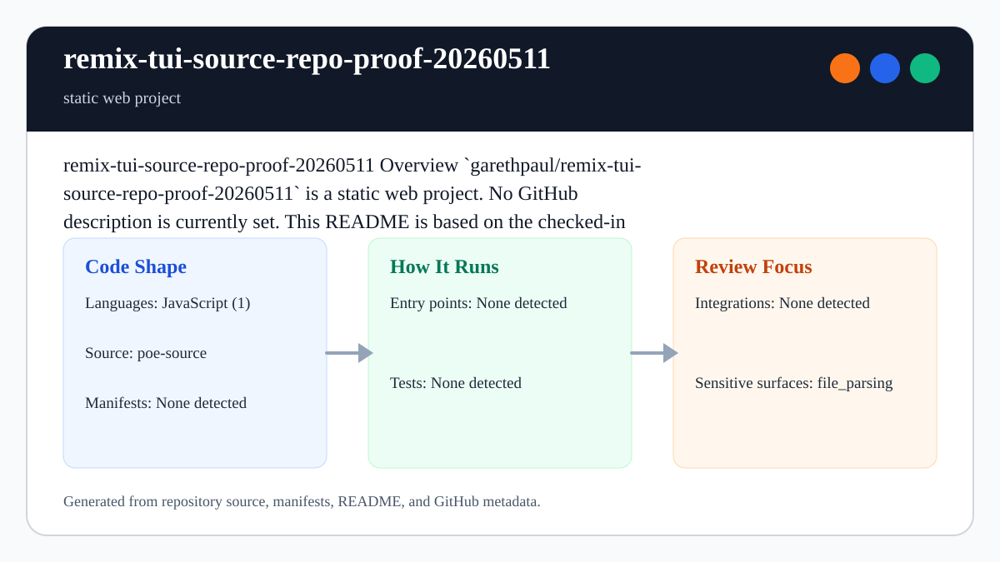

# remix-tui-source-repo-proof-20260511

<!-- README-OVERVIEW-IMAGE -->


## Overview

`garethpaul/remix-tui-source-repo-proof-20260511` is a static web project. The checked-in files describe a static web project with the structure summarized below.

This README is based on the checked-in source, manifests, scripts, and repository metadata on the `main` branch. The project language mix found during review was: JavaScript (1).

## Repository Contents

- `README.md` - project overview and local usage notes
- `CHANGES.md` - maintenance history for repository checks and source proof updates
- `Makefile` - local verification entry points
- `docs/plans` - completed maintenance plans for the current baseline
- `plans` - historical implementation notes
- `poe-source` - source or example code
- `scripts` - dependency-free proof source validators
- `SECURITY.md` - security reporting and disclosure guidance
- `VISION.md` - project direction and maintenance guardrails

Additional scan context:

- Source directories: poe-source
- Dependency and build manifests: none detected
- Entry points or build surfaces: none detected
- Test-looking files: no obvious test files detected

## Getting Started

### Prerequisites

- Git

### Setup

```bash
git clone https://github.com/garethpaul/remix-tui-source-repo-proof-20260511.git
cd remix-tui-source-repo-proof-20260511
```

The setup commands above are derived from repository files. Legacy mobile, Python, or JavaScript samples may require older SDKs or package versions than a modern workstation uses by default.

## Running or Using the Project

- Open `poe-source/index.html` directly in a browser, or serve it locally with `python3 -m http.server --directory poe-source 8000`.
- The proof manifest identifies `index.html` as the entrypoint and documents the expected `GameLogic.runDemo()` summary: `Repo crystal rally source complete`.
- The proof HTML and manifest declare a self-only Content Security Policy for
  scripts, styles, base URIs, and object content.
- The proof manifest records SHA-256 digests for the HTML, JavaScript, and CSS
  proof files.
- The proof validator keeps manifest entries and HTML asset references inside
  `poe-source`.
- The proof status message is exposed as a polite live region for assistive
  technology.
- The proof demo buttons update the status live region through the checked-in
  `GameLogic.bindDemoActions(document)` browser binding. The binding ignores
  malformed host documents and button entries.

## Testing and Verification

- Run `make check` before committing proof source changes.
- `make check` delegates to `make verify`, which runs the dependency-free source proof smoke checks for manifest metadata, file digests, local HTML links, the self-only security policy, and the `GameLogic.runDemo()` summary.
- GitHub Actions runs the same no-install checks on Node.js 20 and 24 using
  immutable action revisions and read-only repository permissions.
- The local path checks reject manifest entries or HTML asset references that
  try to escape `poe-source`.
- The HTML checks also require the visible status message to keep `role="status"`
  with `aria-live="polite"` and `aria-atomic="true"`, and require proof demo
  action buttons to declare `type="button"`.
- The CSS checks require demo buttons to keep an explicit visible
  `button:focus-visible` outline.
- The JavaScript checks require demo action buttons to expose deterministic
  status text, update the live region when clicked, and ignore malformed
  binding inputs. Unknown action names, including inherited object property
  names, must use the documented proof summary fallback.
- The HTML checks require demo action buttons to declare that they control the
  status live region.
- The source proof validator also requires completed canonical plans under `docs/plans`.

When the required SDK or runtime is unavailable, use static checks and source review first, then verify on a machine that has the matching platform toolchain.

## Configuration and Secrets

- No required secret or credential file was identified in the repository scan. If you add integrations later, keep secrets out of git.

## Security and Privacy Notes

- Review changes touching file, media, JSON, XML, CSV, OCR, or data parsing; examples from the scan include poe-source/PACKAGE_MANIFEST.json.

## Maintenance Notes

- See `SECURITY.md` for vulnerability reporting and safe research guidance.
- See `VISION.md` for project direction and contribution guardrails.
- See `docs/plans/2026-06-08-remix-tui-source-proof-baseline.md` for the
  canonical static proof validation baseline.
- See `docs/plans/2026-06-08-proof-file-digests.md` for the proof digest
  validation baseline.
- See `docs/plans/2026-06-09-proof-path-containment.md` for the source-root
  path containment guard.
- See `docs/plans/2026-06-09-proof-status-live-region.md` for the proof status
  live-region guard.
- See `docs/plans/2026-06-09-proof-status-atomic.md` for the proof status
  atomic live-region guard.
- See `docs/plans/2026-06-09-proof-button-type-guard.md` for the proof demo
  button type guard.
- See `docs/plans/2026-06-09-proof-button-focus-visible.md` for the proof demo
  keyboard focus guard.
- See `docs/plans/2026-06-09-proof-demo-button-status.md` for the proof demo
  button status guard.
- See `docs/plans/2026-06-09-proof-button-status-controls.md` for the proof
  demo button `aria-controls` guard.
- See `docs/plans/2026-06-10-hosted-proof-validation.md` for the hosted
  validation baseline.
- See `docs/plans/2026-06-10-proof-demo-binding-guard.md` for malformed demo
  document binding guards.
- See `docs/plans/2026-06-10-proof-action-own-property.md` for the demo action
  own-property lookup guard.

## Contributing

Keep changes small and tied to the project that is already present in this repository. For code changes, document the toolchain used, avoid committing generated dependency directories or local configuration, and update this README when setup or verification steps change.
